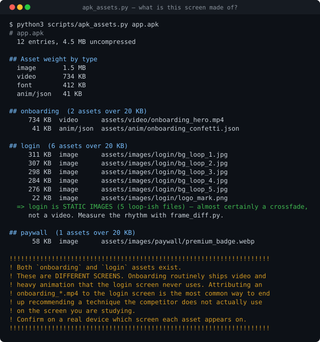
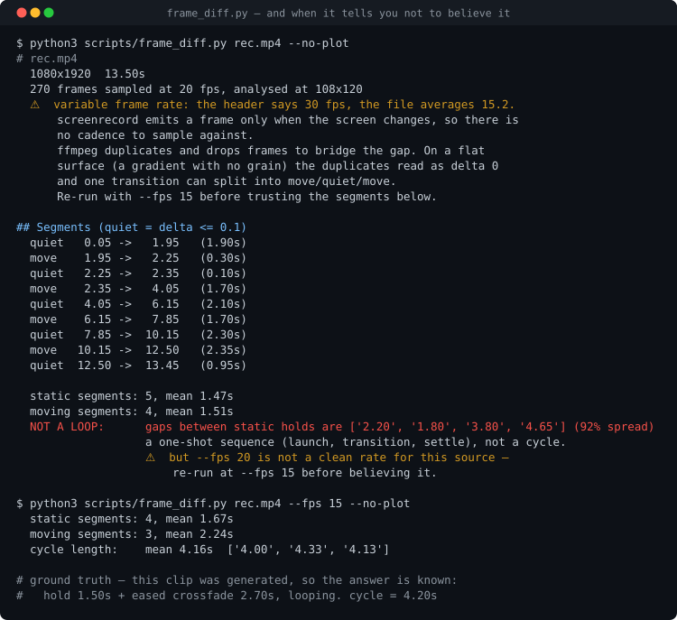
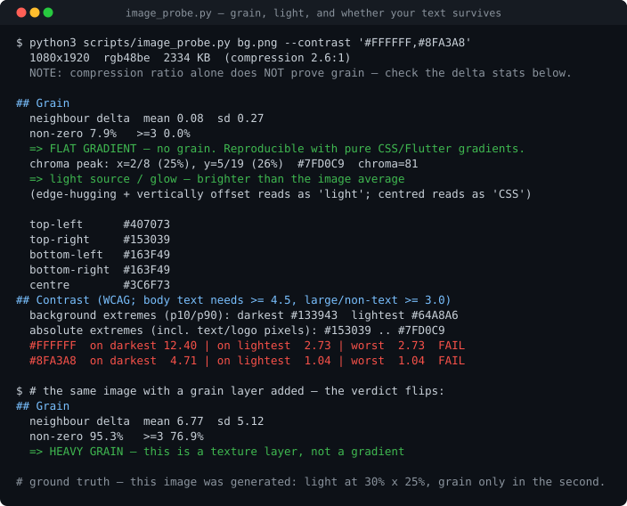

<div align="center">

# how-they-built-it

**You saw a screen you liked. This measures how it was actually built,
and hands you numbers you can build from.**

A [Claude Code](https://claude.com/claude-code) skill — and an
[agents.md](https://agents.md) workflow for Codex, Cursor, Windsurf, Gemini CLI
and the rest. The scripts are plain Python, so it also works with no agent at all.

[中文说明](README.zh-CN.md) · Android + web · MIT

</div>

---

## Why not just look at it?

Looking gets you "it uses a big photo and soft light" — which nobody can build
from, and which is **usually wrong**. A 2.7-second eased crossfade reads to the
human eye as *"changes every 2.5 seconds with a 0.6-second fade."* That is a 4×
error, and it went into a design document before anyone measured it.

| You want to know | How it gets answered |
|---|---|
| Is that background a video, a Lottie, or five JPEGs? | The app package's asset inventory |
| How long is that transition, and what curve? | Per-frame difference over a screen recording |
| Does that gradient have grain, or can I just draw it in CSS? | Neighbour-pixel delta statistics |
| Where is the light actually centred? | Chroma peak on a downsampled grid |
| Will my text still pass contrast on it? | WCAG against the measured extremes |
| On-device or cloud? Which SDKs did they buy? | Native libs, hosts and API paths in the package |

Anything that cannot be measured is labelled as inference. **That distinction is
the whole point.**

## What it looks like

Point it at a package and ask what a screen is made of:



That background had been assumed to be video. Five JPEGs and a crossfade,
about 1.2 MB — which changes the entire production plan. The shouting block at
the bottom is the mistake this tool exists to prevent: an `onboarding_*.mp4`
attributed to the login screen, which happened twice before the check existed.

Then measure the rhythm — and notice what the tool does when it *cannot* answer:



Same clip, twice. At the default sampling rate it reports `NOT A LOOP` — and
says, on that same line, that its own sampling rate is wrong for this source.
Re-run as instructed and the real 4.2-second cycle comes back. **A measurement
tool that cannot say "don't believe this one" is worse than no tool.**

And how the image itself was made:



Flat gradient, no grain — so you can draw it in CSS instead of shipping an
asset. But white text passes over the dark part (12.40) and **fails over the
glow (2.73)**, which you would not have found by looking.

> Every figure above is real output. The inputs are synthetic fixtures generated
> for the README — a fake APK, a clip built with a known 2.7s crossfade, an image
> with the light placed at a known point — so the answers can be checked against
> a ground truth, and so no competitor's pixels are in this repository.
> Regenerate with `./tools/make_figures.sh`.

## What you actually say to it

You do not learn a command set. You say what you want; it hears one of three
entry points.

| You say | It does |
|---|---|
| "analyse how XYZ builds their login screen" · "is that background a video?" · "how long is that transition?" | **Tears down one screen** → mechanism + numbers you can build from |
| "I'm designing an empty state and I'm stuck" · "how do the good onboarding flows do it?" | **Finds three references** (web *and* app) → what each does, where they agree, where they diverge, which route fits you |
| "we want to build auto-chaptering — research how others do it" · "is their transcription on-device or cloud?" | **Researches one feature** → requirements, feature breakdown, technical breakdown |

It asks before it downloads a package, drives someone's app, or writes data anywhere.

## Install

```bash
git clone https://github.com/DEOWL-kan/how-they-built-it.git
```

**Claude Code** — symlink it as a skill, then just ask:

```bash
ln -s "$PWD/how-they-built-it" ~/.claude/skills/how-they-built-it
```

> analyse how XYZ builds their login screen — ours feels cheap next to it

**Codex, Cursor, Windsurf, Gemini CLI, opencode, Amp** and anything else that
follows the [agents.md](https://agents.md) convention — `AGENTS.md` at the repo
root is the entry point, authorization gates included:

> read AGENTS.md in ./how-they-built-it, then tear down XYZ's onboarding

**No agent at all** — every script takes `--help`, and `SKILL.md` is the workflow
in full.

Requirements: Python 3.8+ (standard library only), `ffmpeg`/`ffprobe` on PATH,
plus `adb` for Android devices. Nothing to `pip install`.

Triggering is measured, not hoped for: **35/36** on the 36-query tuning set in
`evals/`, **10/12** held out. "their paywall looks expensive, ours doesn't" and
"is that background a video?" reach it; "design me a login page" deliberately
does not. ⚠️ The held-out set has since been used to fix one missing phrasing
category, so it is no longer independent *for that category* — `ROADMAP.md` says
which, and the next round needs fresh queries.

## Reading the output honestly

Findings carry an evidence tag, and the tags are not decoration:

- **`[device]`** — you watched it happen; cite the recording timestamp
- **`[package]`** — traced to a named file. Proves those *bytes shipped*, never
  that the feature is live, reachable, or on for every user
- **`[inferred]`** — the evidence does not carry the claim, **including when you
  have both other tags but they only support something weaker**

⭐ Architecture conclusions ("their transcription runs in the cloud") stay
`[inferred]` even with both other tags. "No on-device inference library" plus
"fails in airplane mode" still does not rule out local inference gated behind a
login check. Fifteen rounds of adversarial review went into that one line.

## Doing it by hand

Every step is a script you can run yourself:

```bash
python3 scripts/preflight.py                    # what's missing before you start

adb shell pm path com.example.app               # already installed = zero download
adb pull <each path> .

python3 scripts/apk_assets.py base.apk --screen login        # what is this SCREEN made of
python3 scripts/feature_probe.py *.apk --keyword transcri    # what is this FEATURE made of
                                                             # (pass every split — native
                                                             #  libs are never in base.apk)

adb shell am force-stop com.example.app                      # record cold, recorder first
adb shell screenrecord --time-limit 20 /sdcard/rec.mp4 && adb pull /sdcard/rec.mp4 .

python3 scripts/frame_diff.py rec.mp4 --suggest-crop         # where is the motion?
python3 scripts/image_probe.py bg.png --grid 9x20 --contrast '#1E2C28'
```

| Script | Question it settles |
|---|---|
| `preflight.py` | What is missing (ffmpeg / adb / device), with the install command |
| `apk_assets.py` | Video, Lottie, or five JPEGs? Which screen owns each asset? |
| `feature_probe.py` | On-device or cloud? Which SDKs did they buy instead of build? |
| `frame_diff.py` | How long, what easing, does it loop, which region is even moving? |
| `image_probe.py` | Grain or pure gradient? Where is the light? Does your text pass WCAG? |
| `test_regressions.py` | One sample per bug this toolkit has ever had — run it after any change |

`references/` holds the rest: `pitfalls.md` (thirty entries),
`feature-research.md` (the feature-research path and its evidence-tag rules),
`web.md` (web products read their specs in the clear — a much shorter route) and
`android.md` (device and package commands).

## Boundaries

This is for understanding **mechanisms**, so you can build your own thing
better. It is not for taking anyone's work.

| | |
|---|---|
| Analysing timings, colours, structure, asset types | ✅ |
| Turning findings into your own specs and rebuilding | ✅ |
| Screenshots and frames for analysis | ✅ label them |
| **Downloading a free package from a public source** | ⚠️ **ask first**, then check its version |
| Signing into the user's store account to fetch one | ⛔ never |
| Paid apps, region-locked apps | ⛔ never |
| Shipping or committing a competitor's assets | ⛔ never |
| Bypassing paywalls, patching clients, circumventing DRM | ⛔ never — this reads publicly distributed packages only |

## Why `references/pitfalls.md` is the most useful file here

Almost every one of its thirty entries is a mistake that actually happened (the
exceptions say so in the entry): attributing an onboarding video to a login
screen — twice; estimating animation timing from 1 fps samples; inferring
texture from file size; painting a competitor's product details onto your own
spec sheet.

Entries 9–14 came from turning the scripts loose on apps they had never seen,
and five of the six are the *scripts* being wrong rather than the analyst — a
`ble` substring that matched `drawable` and put 1976 of one app's 2886 assets in
the "device" bucket; a contrast check that scored a headline against its own
pixels; a "cycle length" reported for a sequence that never repeats. Entry 30
came from building the figure at the top of this README. Each is now pinned by a
sample in `scripts/test_regressions.py`.

## Known limitations

Stated plainly, because a teardown tool that overstates its own reach is the
worst kind.

**Android only; iOS is an explicit non-goal.** There is no adb for iPhone, so
the asset inventory — the step that actually settles "video or five JPEGs" —
cannot run at all. For iOS-first apps you get motion and pixel analysis and
nothing else.

**Screen recordings are variable frame rate.** `adb shell screenrecord` has no
`--fps` flag and emits a frame only when the screen changes — measured, 2s of a
static screen produced a single frame — while still labelling the file
`r_frame_rate=30/1`. On a flat gradient that makes resampling artifacts look
like real motion. The script now detects this and says so (pitfall 30), but the
warning is only as good as your willingness to re-run.

**Eased transition durations read short.** Measured against a known 2.7s
crossfade, the reported duration was 2.16–2.38s; the deficit lands in the
adjacent static hold. Treat transition duration as a lower bound. `cycle length`
is immune to this and is the number to quote.

**Subtle motion needs a higher resolution.** `frame_diff.py` downsamples before
differencing, so 3px of drift on a 1080px capture is 0.3px at the default and
gets smoothed away. It warns and tells you to raise `--res`, but it cannot
detect what it never resolved.

**Contrast wants a background, not a screenshot.** Feed `image_probe.py
--contrast` the extracted background asset. On a screenshot the darkest
"background" pixel is the body text itself. And if any scrim sits between text
and background, none of these numbers are the shipping values.

**Split APKs: it depends what you are asking.** For a *visual* teardown
`base.apk` is normally the whole answer — over 99% of asset weight across six
shipping apps. For a *feature* one it never is: every native library sat in
`split_config.<abi>.apk`. `feature_probe.py` takes as many packages as you pass
it; say in the report which splits you actually had.

**Screen buckets are a keyword heuristic.** Treat them as a lead, not an
inventory, and grep the full paths with your own product's vocabulary.

**Getting from teardown to your own design is still on you.** This produces a
specification of how someone else did it. Deciding what applies to your product
— and what should be deliberately different — is judgement the tooling does not
supply.

## License

MIT — see [LICENSE](LICENSE). Contributions welcome; see [CONTRIBUTING.md](CONTRIBUTING.md).
